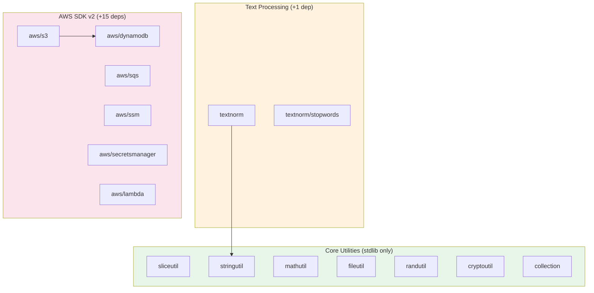
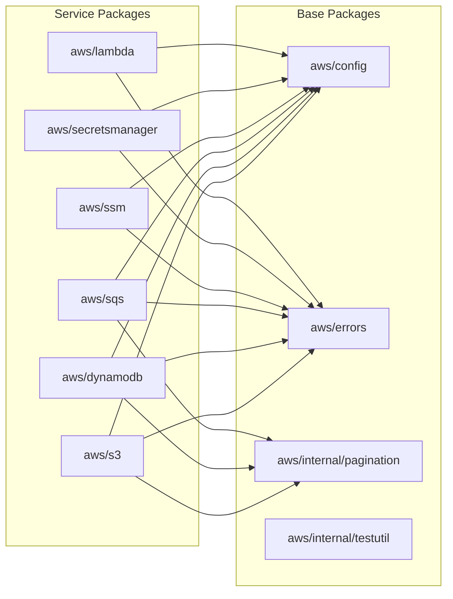

# Architecture

This page describes the structure, design patterns, and relationships between GoGPUtils packages.

## Package Overview

GoGPUtils is organized into three layers: **Core utilities** (stdlib only), **Text processing** (one external dep), and **AWS SDK wrappers** (many external deps).



## Package Sizes

| Package              | Lines of Code | Functions | Tests | Test Ratio |
| -------------------- | ------------- | --------- | ----- | ---------- |
| `stringutil`         | 3,609         | 76        | 88    | 1.16x      |
| `sliceutil`          | 2,367         | 117       | 58    | 0.50x      |
| `mathutil`           | 1,991         | 108       | 57    | 0.53x      |
| `fileutil`           | 1,735         | 87        | 42    | 0.48x      |
| `collection`         | 1,683         | 112       | 40    | 0.36x      |
| `textnorm`           | 1,057         | 59        | 38    | 0.64x      |
| `randutil`           | 1,010         | 62        | 27    | 0.44x      |
| `cryptoutil`         | 665           | 34        | 19    | 0.56x      |
| `aws/s3`             | 1,850         | ~45       | ~25   | 0.56x      |
| `aws/dynamodb`       | 1,714         | ~55       | ~20   | 0.36x      |
| `aws/secretsmanager` | 1,353         | ~20       | ~15   | 0.75x      |
| `aws/sqs`            | 1,182         | ~30       | ~15   | 0.50x      |
| `aws/ssm`            | 1,067         | ~22       | ~12   | 0.55x      |
| `aws/lambda`         | 588           | ~15       | ~8    | 0.53x      |

**Observations:**

- `stringutil` is the largest package (similarity algorithms + cleaning + validation)
- `collection` has the most functions (BST, Stack, Queue, Set) but fewest tests per function
- AWS packages are roughly evenly structured: ~50% test ratio

## Import Dependencies

### Core Layer (stdlib only)

These packages import **only** the Go standard library:

```
collection  → cmp, slices
sliceutil   → internal/constraints
stringutil  → internal/constraints
mathutil    → internal/constraints
fileutil    → (stdlib only)
cryptoutil  → crypto/aes, crypto/cipher, crypto/rand
randutil    → crypto/rand, math/rand
```

The `internal/constraints` package is a shared type-bound package:

```go
// Used by sliceutil, stringutil, mathutil
type Number interface { ~int | ~int8 | ... | ~float32 | ~float64 }
type Integer interface { ~int | ~int8 | ... | ~uint64 }
type Ordered interface { ~int | ~int8 | ... | ~string }
```

### Text Layer

```
textnorm  → stringutil (for case folding)
          → textnorm/stopwords (embedded word lists)
          → golang.org/x/text (Unicode normalization)
```

This is the only non-AWS package with an external dependency (`x/text`).

### AWS Layer

All AWS service packages import from `aws/config` and `aws/errors`:



**Key insight:** Every AWS service constructor follows the same pattern:

```go
func NewClient(ctx context.Context, region string) (*Client, error) {
    cfg, err := awsconfig.Load(ctx, region)
    if err != nil {
        return nil, errors.WrapError(err, "failed to load AWS config")
    }
    return NewClientWithConfig(cfg), nil
}
```

## Design Patterns

### 1. Non-Mutating by Default

Functions return new values. The original is never modified unless explicitly named:

```go
// Returns NEW slice
filtered := sliceutil.Filter(original, predicate)

// Modifies IN PLACE (explicitly named)
sliceutil.FilterInPlace(&original, predicate)
```

### 2. Error Wrapping

Instead of returning raw errors, AWS packages wrap them:

```go
// aws/errors.go provides consistent wrapping
func WrapError(err error, msg string) error {
    if err == nil { return nil }
    return fmt.Errorf("%s: %w", msg, err)
}

// Usage in every AWS service
if err != nil {
    return errors.WrapError(err, "failed to put object")
}
```

This gives you error chains like: `failed to put object: operation error S3: PutObject, ...`

### 3. Option Pattern (AWS)

AWS service functions use variadic option functions:

```go
// S3 put with options
err := client.PutObject(ctx, bucket, key, data,
    s3.WithMetadata(map[string]string{"version": "1.0"}),
    s3.WithContentType("application/json"),
)
```

### 4. Pipeline Pattern (textnorm)

Text normalization uses immutable pipelines:

```go
pipeline := textnorm.New().
    Then(textnorm.RemoveAccents).
    Then(textnorm.FoldCase).
    Then(textnorm.CollapseWhitespace)

result := pipeline.Run(input)  // input is unchanged
```

## Testing Patterns

### Table-Driven Tests

Every package uses Go's idiomatic table-driven pattern:

```go
func TestSum(t *testing.T) {
    tests := []struct{
        name     string
        input    []int
        expected int
    }{
        {"empty", []int{}, 0},
        {"single", []int{5}, 5},
        {"multiple", []int{1, 2, 3}, 6},
    }
    for _, tt := range tests {
        t.Run(tt.name, func(t *testing.T) {
            got := Sum(tt.input)
            if got != tt.expected {
                t.Errorf("Sum() = %v, want %v", got, tt.expected)
            }
        })
    }
}
```

### AWS Integration Tests

AWS packages test against LocalStack (a local AWS emulator):

```go
func TestS3PutAndGet(t *testing.T) {
    ctx := context.Background()
    client := setupTest(t)  // Creates LocalStack container

    bucket := "test-bucket"
    err := client.CreateBucket(ctx, bucket)
    require.NoError(t, err)

    err = client.PutObject(ctx, bucket, "key", []byte("hello"))
    require.NoError(t, err)

    data, err := client.GetObject(ctx, bucket, "key")
    require.NoError(t, err)
    assert.Equal(t, "hello", string(data))
}
```

## Complexity Hotspots

Based on lines of code per function, these are the most complex areas:

| Package                    | Complexity Driver                                               |
| -------------------------- | --------------------------------------------------------------- |
| `stringutil/similarity.go` | 7 similarity algorithms (Levenshtein, Jaro-Winkler, Dice, etc.) |
| `sliceutil/sliceutil.go`   | 59 generic functions with type constraints                      |
| `collection/bst.go`        | BST implementation with recursive operations                    |
| `aws/dynamodb`             | Query/scan builder with many option combinations                |
| `aws/s3`                   | Object operations with multipart upload support                 |

## External Dependencies

| Package  | External Dependencies   | Why                   |
| -------- | ----------------------- | --------------------- |
| Core (7) | 0                       | Pure stdlib           |
| textnorm | 1 (`golang.org/x/text`) | Unicode normalization |
| aws/*    | 15 (`aws-sdk-go-v2/*`)  | AWS service clients   |
