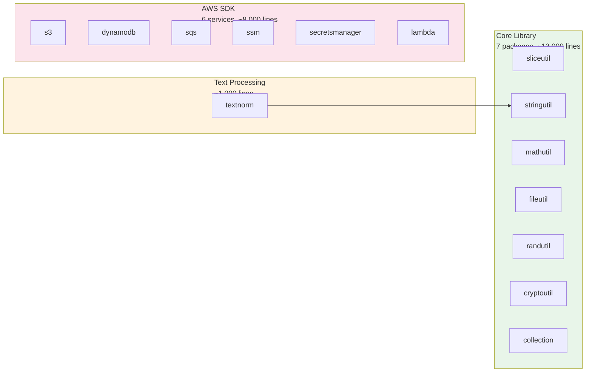
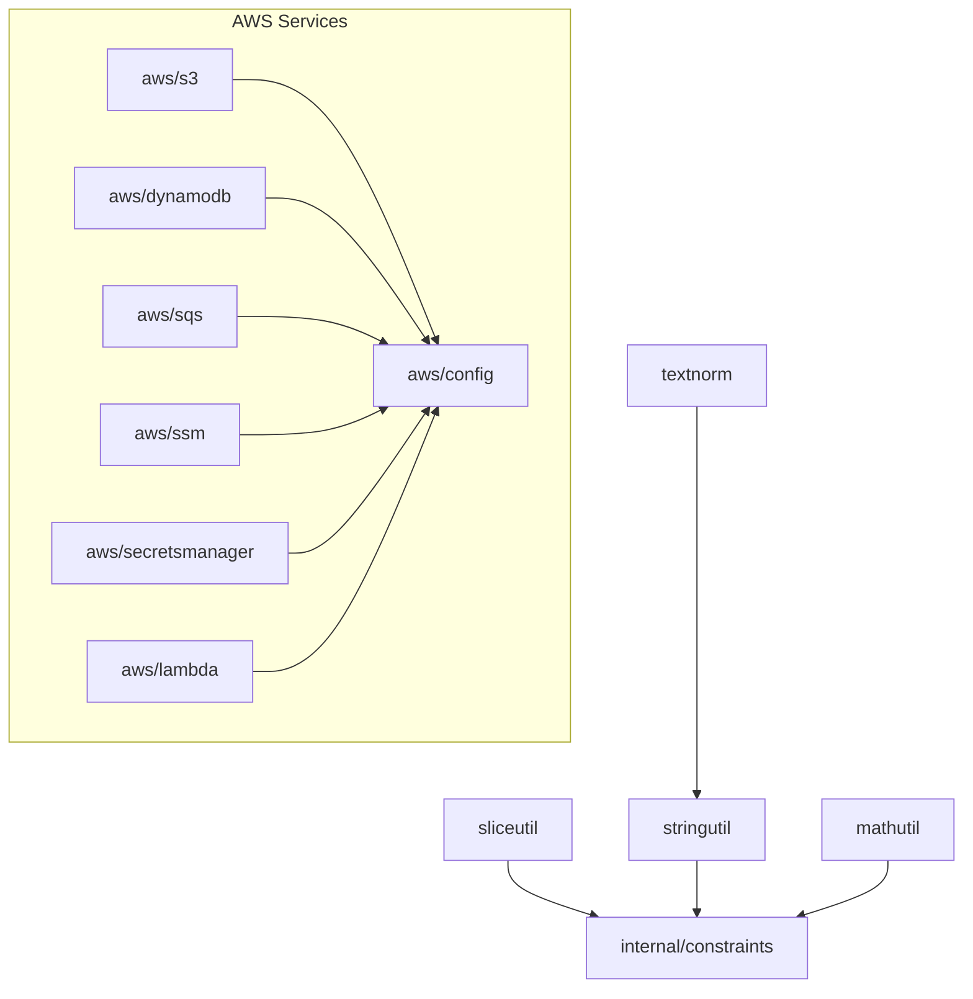

# Codebase Analysis

This page summarizes a structural analysis of the GoGPUtils codebase. The goal is to understand where complexity lives, how packages interact, and what patterns emerge across the code.

## Why This Exists

GoGPUtils has **93 source files** and **~76,000 words** of code. When a codebase reaches this size, it is easy to lose track of cross-package patterns. This analysis uses AST extraction to map every function, type, and test into a graph, then clusters the graph to find natural groupings.

## The Big Picture

## What the Graph Found

We extracted **1,184 nodes** (functions, methods, types, tests) and **2,047 edges** (function calls, type usages, imports). The clustering algorithm found **89 communities** — loose groups of functions that tend to call each other. Most communities are simple: "all the functions in `fileutil`" or "all the tests for `collection.BST`".

### The Most Central Code

The most "connected" nodes in the graph are:

| Node               | Connections | What It Actually Means                                                          |
| ------------------ | ----------- | ------------------------------------------------------------------------------- |
| `WrapError()`      | 46          | Every AWS service calls this to wrap errors consistently                        |
| `setupTestDir()`   | 28          | File tests create temp directories frequently                                   |
| `createTestFile()` | 24          | File tests create temporary files for reading/writing                           |
| `New()`            | 21          | Multiple packages have a `New()` constructor (BST, Queue, Stack, Set, Pipeline) |
| `Copy()`           | 21          | File copy is a core operation with many call paths                              |

**The takeaway:** The center of the codebase is error wrapping (AWS) and test infrastructure. This is healthy — it means the core utilities are independent and do not have hidden coupling.

### Clustering by Package

When you group communities by the package they belong to, you get a clear picture:

| Package        | Communities | Notes                                                                        |
| -------------- | ----------- | ---------------------------------------------------------------------------- |
| `stringutil`   | 3           | Split into: core string functions, cleaning functions, similarity algorithms |
| `sliceutil`    | 2           | Split into: core operations and grouping/chunking operations                 |
| `collection`   | 1           | All data structures live in one tight cluster                                |
| `mathutil`     | 2           | Split into: basic math and matrix/vector operations                          |
| `aws/dynamodb` | 2           | Split into: client operations and query/scan builder                         |
| `aws/s3`       | 2           | Split into: object operations and bucket operations                          |
| `aws/sqs`      | 1           | Messaging operations are tightly coupled                                     |
| `fileutil`     | 1           | File operations cluster together strongly                                    |

**What this tells us:** The codebase has low cross-package coupling. Each package is internally cohesive and does not leak abstractions into other packages. The `stringutil` and `sliceutil` splits reflect natural sub-domains (validation vs. cleaning, filtering vs. grouping).

### Surprising Findings

1. **No core package depends on another core package.**
   - `sliceutil` does not call `stringutil`
   - `mathutil` does not call `fileutil`
   - Each utility stands alone

2. **AWS services share infrastructure but not business logic.**
   - All AWS services call `awsconfig.Load()` and `errors.WrapError()`
   - No service calls into another service (S3 does not call DynamoDB)

3. **`textnorm` is the only bridge package.**
   - It is the only non-AWS package that depends on another package (`stringutil`)
   - This is a designed dependency — text normalization needs string case folding

4. **Test code equals production code in size.**
   - Some packages have more test lines than production lines
   - This indicates good coverage but you should check if the tests add value or are redundant

## What the Numbers Mean

| Metric              | Value                        | Interpretation                                                            |
| ------------------- | ---------------------------- | ------------------------------------------------------------------------- |
| 1,184 nodes         | ~1,200 functions/types/tests | Medium-sized library                                                      |
| 89 communities      | ~13 nodes per community      | Fine-grained clustering; each file is its own world                       |
| 72% EXTRACTED edges | Real calls/imports           | Most relationships are real, not inferred                                 |
| 28% INFERRED edges  | Pattern-based links          | These are "this looks like that" connections; some may be false positives |

## Recommendations for Contributors

1. **Adding a new utility?** Put it in the existing package that matches the domain. The clusters show that domains are well-separated.
2. **Adding a new AWS service?** Copy the pattern from `aws/sqs` (smallest, simplest). It has 1 community and clear boundaries.
3. **Refactoring?** The `stringutil` and `sliceutil` packages are large. If they grow past 3,000 lines, consider splitting by sub-domain (the communities already suggest natural split points).

## Dependency Sanity Check

Here is the actual import graph, verified with `go list`:

This is a clean, shallow dependency graph. No circular dependencies. No package calls up or sideways unexpectedly.
