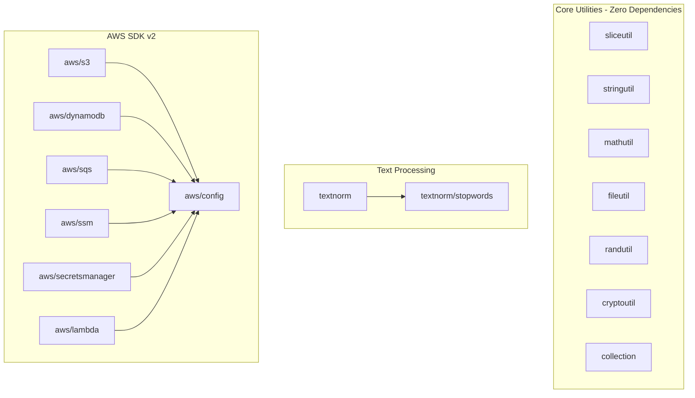
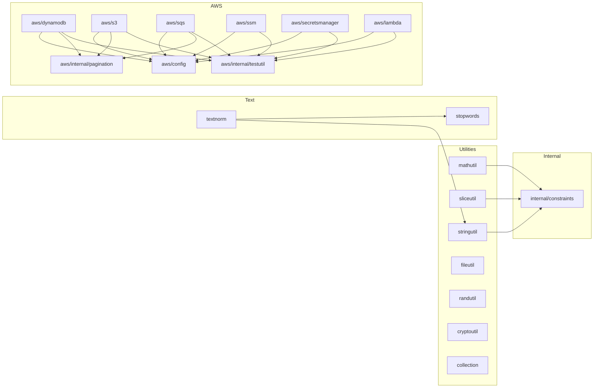

# GoGPUtils

A collection of well-tested, idiomatic Go utilities for common programming tasks. Zero external dependencies for core utilities.

[](https://github.com/alessiosavi/GoGPUtils/actions/workflows/go.yml)
[](https://goreportcard.com/report/github.com/alessiosavi/GoGPUtils)
[](https://godoc.org/github.com/alessiosavi/GoGPUtils)
[](https://opensource.org/licenses/MIT)

> **v1 - Experimental**: This library is in its initial release phase. APIs may change in future versions.

## Installation

```bash
go get github.com/alessiosavi/GoGPUtils
```

## Design Philosophy

- **Errors over panics**: All functions return errors instead of panicking
- **Zero global state**: No singletons; all state is explicit
- **Generic when useful**: Uses generics to reduce duplication without over-abstraction
- **Minimal dependencies**: Core library has zero external dependencies
- **Context-aware**: Blocking operations accept `context.Context`

## Package Architecture



## Package Dependency Graph



## Packages

| Package                                | Description                                                          | Dependencies              |
| -------------------------------------- | -------------------------------------------------------------------- | ------------------------- |
| [`sliceutil`](packages/sliceutil.md)   | Generic slice operations (filter, map, reduce, chunk, etc.)          | `internal/constraints`    |
| [`stringutil`](packages/stringutil.md) | String manipulation and similarity algorithms                        | `internal/constraints`    |
| [`textnorm`](packages/textnorm.md)     | Deterministic text normalization pipelines                           | `stringutil`, `stopwords` |
| [`mathutil`](packages/mathutil.md)     | Mathematical and statistical operations                              | `internal/constraints`    |
| [`fileutil`](packages/fileutil.md)     | File system operations with proper error handling                    | None                      |
| [`cryptoutil`](packages/cryptoutil.md) | Secure AES-GCM encryption                                            | None                      |
| [`randutil`](packages/randutil.md)     | Cryptographically secure random generation                           | None                      |
| [`collection`](packages/collection.md) | Generic data structures (Stack, Queue, Set, BST)                     | None                      |
| [`aws`](aws/index.md)                  | AWS SDK v2 helpers (S3, DynamoDB, SQS, SSM, Secrets Manager, Lambda) | `aws-sdk-go-v2`           |

## Quick Start

### Slice Operations

```go
import "github.com/alessiosavi/GoGPUtils/sliceutil"

numbers := []int{1, 2, 3, 4, 5, 6, 7, 8, 9, 10}

// Filter even numbers
evens := sliceutil.Filter(numbers, func(n int) bool {
    return n%2 == 0
})

// Map transformation
doubled := sliceutil.Map(numbers, func(n int) int {
    return n * 2
})

// Reduce to sum
sum := sliceutil.Reduce(numbers, 0, func(acc, n int) int {
    return acc + n
})
```

### String Similarity

```go
import "github.com/alessiosavi/GoGPUtils/stringutil"

// Levenshtein distance
dist := stringutil.LevenshteinDistance("kitten", "sitting") // 3

// Jaro-Winkler similarity
sim := stringutil.JaroWinklerSimilarity("hello", "hallo", 0.1) // ~0.88
```

### Text Normalization

```go
import "github.com/alessiosavi/GoGPUtils/textnorm"

// Search-optimized normalization
normalized := textnorm.SearchPreset().Run("  Café, go!  ")

// Canonical normalization
clean := textnorm.CanonicalPreset().Run("  Hello, World!  ")
```

## Testing

Run all tests:

```bash
go test ./...
```

Run with race detector:

```bash
go test -race ./...
```

Run benchmarks:

```bash
go test -bench=. ./...
```

## Contributing

Contributions are welcome! Please ensure:

1. All new code has tests
2. Tests pass with race detector enabled
3. Code follows Go conventions (`gofmt`, `golint`)
4. Public APIs are documented

## License

MIT License - see [LICENSE](LICENSE) for details.
