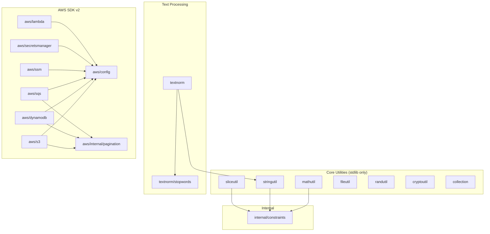

# Packages

GoGPUtils provides focused utility packages for common programming tasks. Each package is designed to be independent with minimal cross-package dependencies.

## Core Utilities

These packages have **zero external dependencies** and work with pure Go:

| Package                     | Description                        | Coverage                                                              |
| --------------------------- | ---------------------------------- | --------------------------------------------------------------------- |
| [sliceutil](sliceutil.md)   | Generic slice operations           | Filter, Map, Reduce, Chunk, GroupBy, Partition, FlatMap, and more     |
| [stringutil](stringutil.md) | String manipulation and similarity | Case conversion, padding, truncation, Levenshtein, Jaro-Winkler, Dice |
| [mathutil](mathutil.md)     | Mathematical operations            | Sum, Average, Median, StdDev, Matrix ops, Vector ops, Number theory   |
| [fileutil](fileutil.md)     | File system operations             | Read/Write, Copy, Move, List, Find, Touch, Temp files                 |
| [cryptoutil](cryptoutil.md) | AES-GCM encryption                 | Encrypt/Decrypt, Key derivation, Hashing                              |
| [randutil](randutil.md)     | Secure random generation           | Secure strings, IDs, choices, sequences                               |
| [collection](collection.md) | Data structures                    | Stack, Queue, Set, Binary Search Tree                                 |

## Text Processing

| Package                 | Description                  | Dependencies              |
| ----------------------- | ---------------------------- | ------------------------- |
| [textnorm](textnorm.md) | Text normalization pipelines | `stringutil`, `stopwords` |

## AWS SDK Helpers

These packages wrap AWS SDK v2 for easier use:

| Package                                     | Description                        | AWS Service     |
| ------------------------------------------- | ---------------------------------- | --------------- |
| [aws](aws/index.md)                         | AWS configuration and shared types | -               |
| [aws/s3](aws/s3.md)                         | S3 object and bucket operations    | S3              |
| [aws/dynamodb](aws/dynamodb.md)             | DynamoDB item and query operations | DynamoDB        |
| [aws/sqs](aws/sqs.md)                       | SQS message operations             | SQS             |
| [aws/ssm](aws/ssm.md)                       | Parameter Store operations         | SSM             |
| [aws/secretsmanager](aws/secretsmanager.md) | Secret management                  | Secrets Manager |
| [aws/lambda](aws/lambda.md)                 | Lambda function operations         | Lambda          |

## Internal Packages

| Package                   | Description                                                            |
| ------------------------- | ---------------------------------------------------------------------- |
| `internal/constraints`    | Generic type constraints used by `sliceutil`, `stringutil`, `mathutil` |
| `aws/internal/pagination` | Shared pagination helpers for AWS service clients                      |
| `aws/internal/testutil`   | LocalStack test utilities for AWS integration tests                    |

## Package Interaction Diagram

